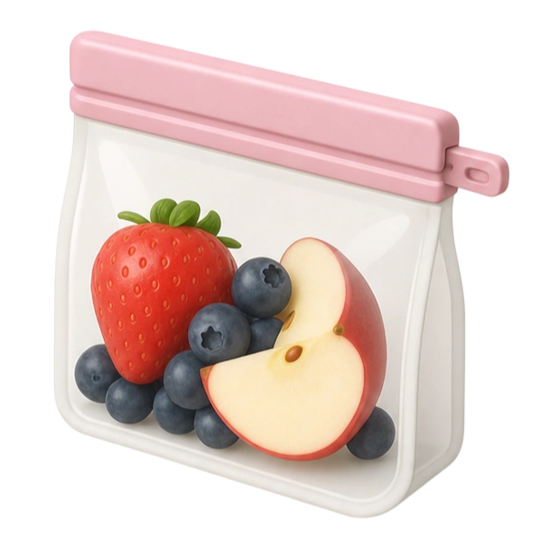

# Compressor (Native SDK)

<p align="center">
  
</p>

<p align="center">
  <sub>App icon from <a href="https://www.thiings.co/">Thiings</a> — free for personal / non-commercial use; attribution required.</sub>
</p>

Full **native** desktop image compressor — no WebView, no React, no browser UI.

- UI: `src/app.native` (Native markup)
- Logic: `src/main.zig` (`Model` / `Msg` / `update_fx`)
- Encode: **Bun** `Bun.file(…).image().webp({ quality })` via `fx.spawn`
- Platforms: **macOS** and **Windows**

## Features

- Browse (platform file dialog) or drop an image
- Convert any common image → **WebP**
- Quality slider in settings (**default 80%**)
- Presets: Light 90 · Medium 80 · Heavy 50
- Shortcuts: **⌘/,** / **Ctrl+,** settings · **⌘O** / **Ctrl+O** browse · **⌘Enter** / **Ctrl+Enter** compress
- Window title: centered on macOS, start-aligned on Windows

## Requirements

- [Zig 0.16](https://ziglang.org/download/) — or let `native dev --yes` download the pinned toolchain into `~/.native/toolchains/`
- [Bun](https://bun.sh) 1.4+ on `PATH` (used for compression)
- [@native-sdk/cli](https://www.npmjs.com/package/@native-sdk/cli) (`npm install -g @native-sdk/cli`)
- Node.js (for the Native CLI)

### macOS

- macOS 11+ with Xcode Command Line Tools / Xcode
- AppKit host with the **software** GPU surface backend
- File picker via `osascript` (`choose file`)

### Windows

- Win32 host with the **software** GPU surface backend
- On high-DPI displays the app opts into **Per-Monitor V2** DPI awareness at startup so the canvas rasterizes at the real device scale (e.g. 1.25× / 1.5× / 2×) instead of letting Windows stretch a 1× bitmap

> **Do not run from WSL / Linux shells.** `native dev` on Linux looks for GTK4 / WebKit and will fail with `unable to find dynamic system library 'gtk4'`. Use **Windows PowerShell or cmd** in the Windows checkout of this repo.

## Setup

### macOS

```bash
npm install -g @native-sdk/cli
# Bun: https://bun.sh — then confirm:
bun --version
native --version
# Optional: install Zig yourself, or let native download it:
# brew install zig   # or https://ziglang.org/download/
```

### Windows

Open **PowerShell** (not WSL / zsh) in this project directory:

```powershell
# Zig 0.16 must be on PATH. On Windows, `native` may not auto-download it.
winget install -e --id zig.zig
# Or run the helper (downloads 0.16.0 into %LOCALAPPDATA%\zig-0.16.0 and updates user PATH):
#   powershell -ExecutionPolicy Bypass -File .\scripts\setup-windows-zig.ps1

npm install -g @native-sdk/cli
# Bun: https://bun.sh — then confirm:
zig version   # expect 0.16.x
bun --version
native --version
```

If PowerShell blocks `native` (`running scripts is disabled`), either:

```powershell
powershell -ExecutionPolicy Bypass -Command "native dev --yes"
```

or allow local scripts for your user:

```powershell
Set-ExecutionPolicy -Scope CurrentUser RemoteSigned
```

## Commands

Run these in the same shell as setup (**macOS Terminal**, or **Windows PowerShell** — not WSL):

```bash
# Validate markup
native check
native markup check src/app.native

# Unit tests (headless)
native test

# Run (native window + hot reload of app.native)
native dev
# First run / CI: skip Zig download prompts
native dev --yes

# Release binary
native build

# Distributable package (run on the target OS)
native package --target macos --signing adhoc --binary zig-out/bin/image-compressor --output zig-out/package/Compressor.app
native package --target windows --binary zig-out/bin/image-compressor.exe --output zig-out/package/windows
```

## Releases (GitHub Actions)

Ship via [GitHub Releases](https://github.com/sonnylazuardi/image-compressor-native-sdk/releases) — same pattern as [gifbin](https://github.com/henryoman/gifbin/releases/tag/v0.0.0): tag a version, CI builds native packages, and [softprops/action-gh-release](https://github.com/softprops/action-gh-release) attaches the zips.

```bash
# bump app.zon if needed, then:
git tag v0.1.0
git push origin v0.1.0
```

Or run **Actions → Release → Run workflow** and pass a version without the leading `v`.

| Artifact | Runner |
| --- | --- |
| `Compressor-macos-arm64.zip` (`.app` inside) | `macos-15` |
| `Compressor-windows-x64.zip` (`.exe` layout) | `windows-latest` |
| `SHA256SUMS` + per-file `.sha256` | release job |

**macOS:** ad-hoc signed — first open with **right-click → Open**. **Windows:** unsigned — SmartScreen may warn. Both still need Bun on `PATH` for compression.

## Bun encoder (CLI)

```bash
bun run scripts/compress.ts --input photo.png --output photo.webp --quality 80
bun test scripts/compress.test.ts
```

## Project layout

```
app.zon                       # app identity, window, shortcuts (macos + windows)
src/app.native                # declarative native UI
src/main.zig                  # Model / Msg / update_fx / effects
src/tests.zig                 # dispatch + markup tests
scripts/compress.ts           # Bun WebP encode
scripts/set-version.sh        # bump app.zon .version for CI releases
scripts/setup-windows-zig.ps1 # optional Zig 0.16 install + PATH (Windows)
.github/workflows/release.yml # tag → macOS + Windows GitHub Release
assets/icon.png
```

Zero-config: no `frontend/`, no `build.zig` — the `native` CLI owns the build graph.
